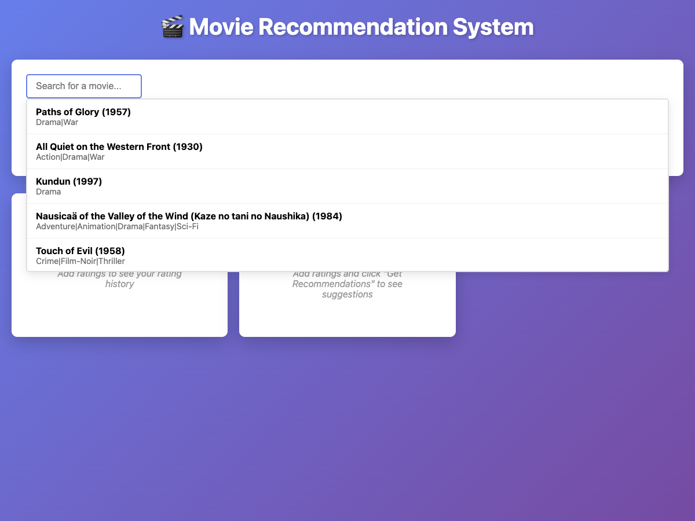
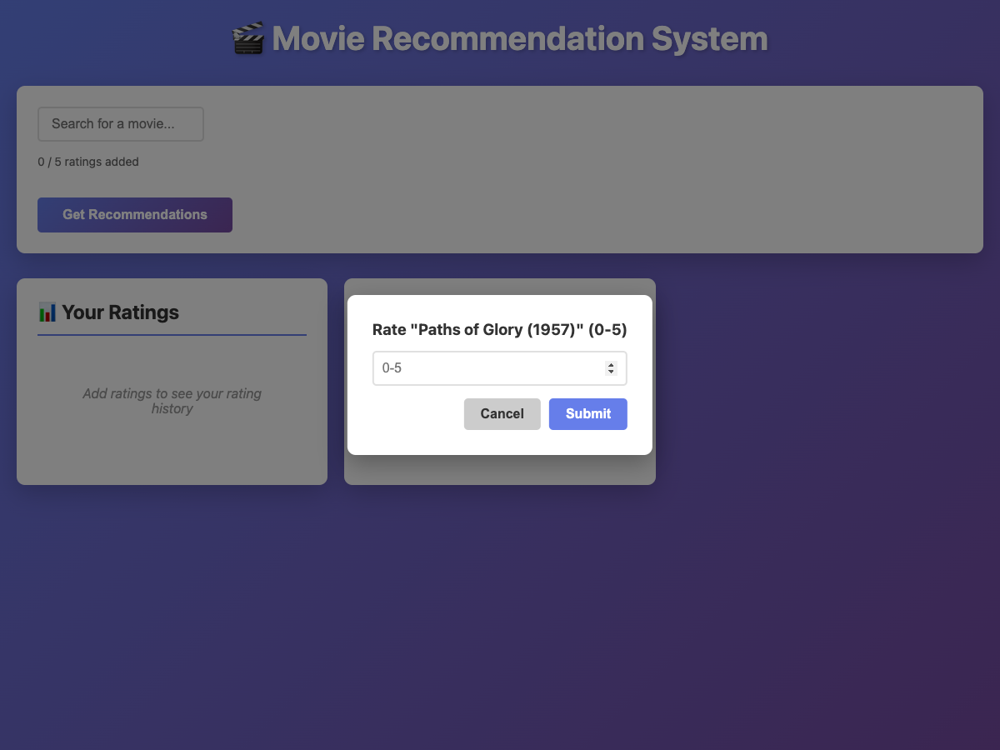

# Movie Recommendation System

A content-based movie recommendation web app built with Flask. Rate up to 5 movies (0–5), and get recommendations based on genre similarity.

## Screenshots

| Main view | Search / top movies | Rating modal |
|-----------|---------------------|--------------|
|  |  |  |

*To generate these screenshots: run the app (`python app.py`), then in another terminal run `pip install playwright && playwright install chromium && python scripts/capture_screenshots.py`.*

## Features

- **Content-based filtering**: Recommendations from your custom ratings using genre similarity.
- **Custom ratings**: Search or pick from top movies, add up to 5 ratings (0–5), then get recommendations.
- **Search & top movies**: Type to search; focus/click the empty search box to see top-rated movies.
- **Rating modal**: Inline modal for entering ratings (no `prompt()`).

## Requirements

- Python 3.7+
- Flask 2.0+
- pandas, numpy, scikit-learn (see `requirements.txt`)

## Setup

1. **Install dependencies:**
   ```bash
   pip install -r requirements.txt
   ```

2. **Data files:**  
   Place `ratings.csv` and `movies.csv` in the project root.  
   - `ratings.csv`: `userId`, `movieId`, `rating` (and optionally `timestamp`)  
   - `movies.csv`: `movieId`, `title` (and optionally `genres`)

3. **Run the app:**
   ```bash
   python app.py
   ```

4. **Open the UI:**  
   Go to **http://localhost:5001**

## Usage

1. **Add ratings:** Use the search box (type at least 2 characters to search, or focus/click when empty to see top movies). Click a movie, enter a rating 0–5 in the modal, submit.
2. Add up to 5 movies. Remove any with “Remove” if needed.
3. Click **Get Recommendations** to see suggested movies with predicted ratings.
4. Your ratings appear under “Your Ratings”; recommendations under “Recommended Movies”.

## API Endpoints

- `GET /api/search-movies?q=<query>&limit=<n>` – Search movies by title
- `GET /api/top-movies?limit=<n>` – Top-rated movies
- `POST /api/custom-recommendations` – Body: `{ "ratings": [ { "movieId": <id>, "rating": <0-5> }, ... ] }`
- `GET /api/movies/<movie_id>` – Movie metadata

## Project Structure

```
.
├── app/
│   ├── __init__.py
│   ├── config.py
│   ├── data_loader.py
│   ├── recommender.py
│   └── routes.py
├── scripts/
│   └── capture_screenshots.py   # Screenshots for README
├── templates/
│   └── index.html
├── app.py
├── requirements.txt
├── screenshots/                  # README screenshots (generated by script)
└── README.md
```

## Notes

- The app loads data at startup; optional Parquet cache (`cache_ratings.parquet`, `cache_movies.parquet`) speeds this up.
- Content-based logic uses genre vectors and cosine similarity in `app/recommender.py`.
